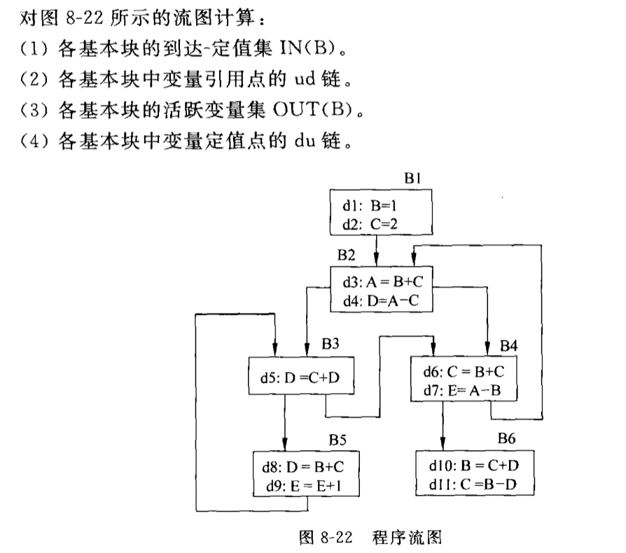
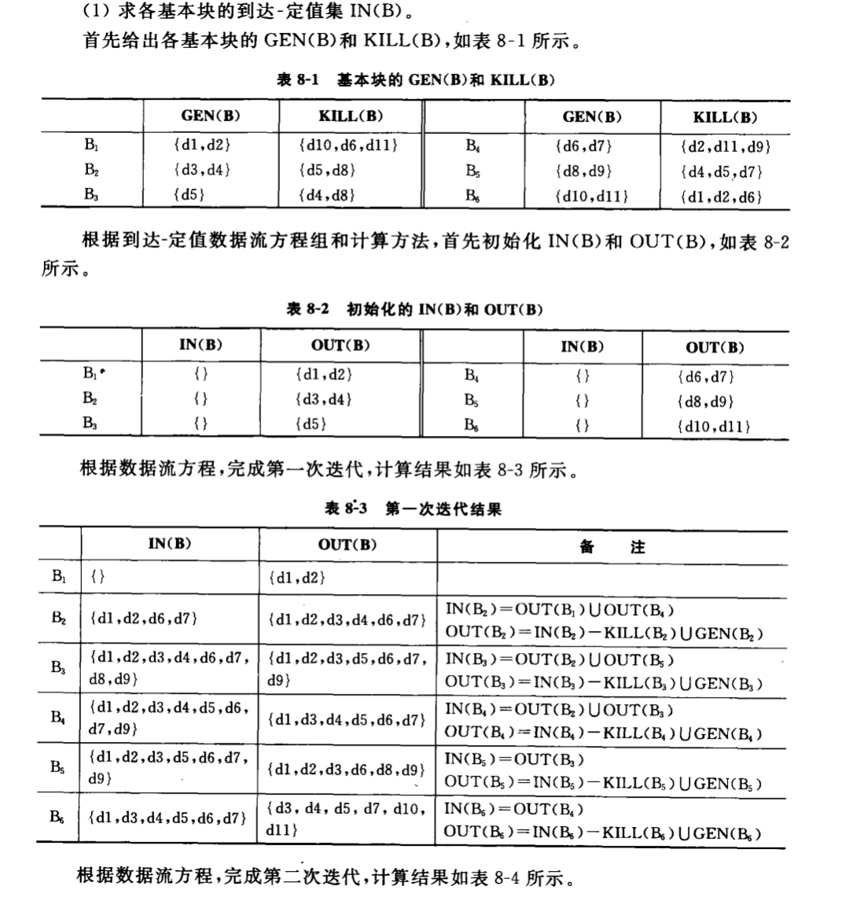
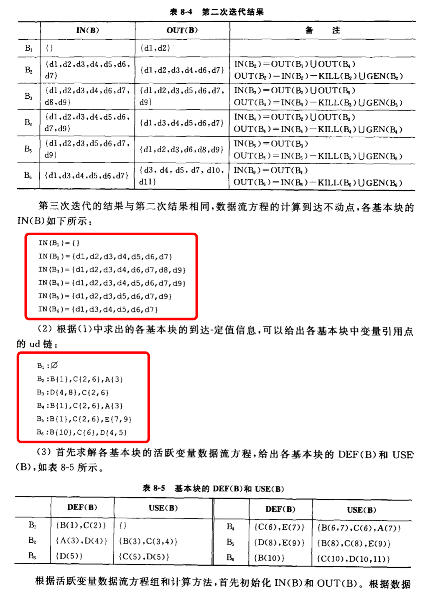
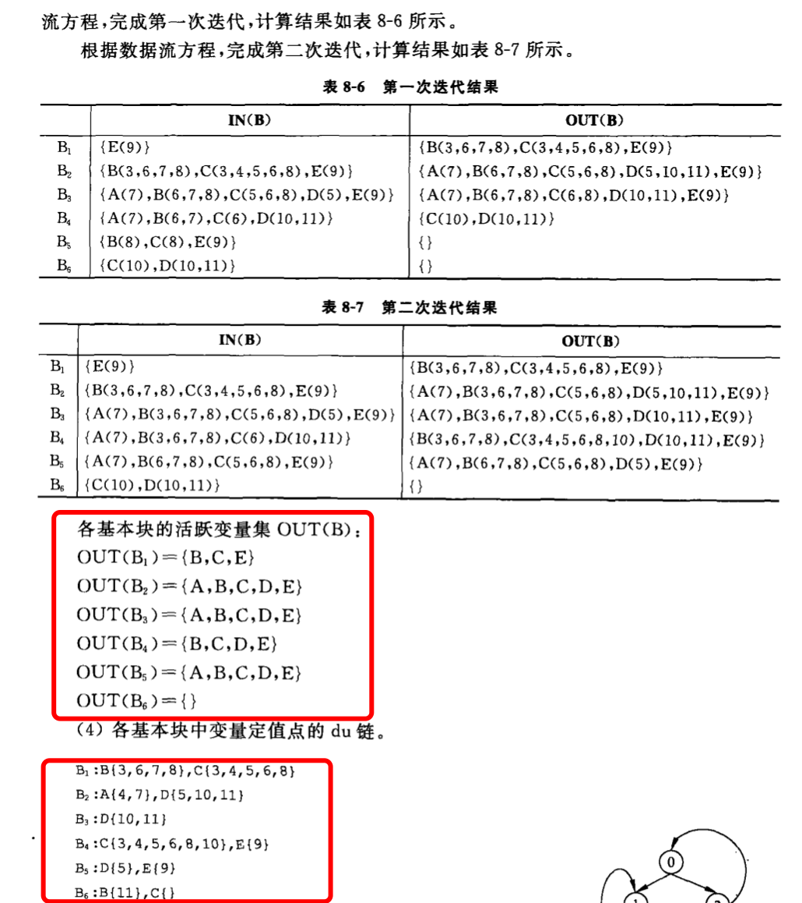
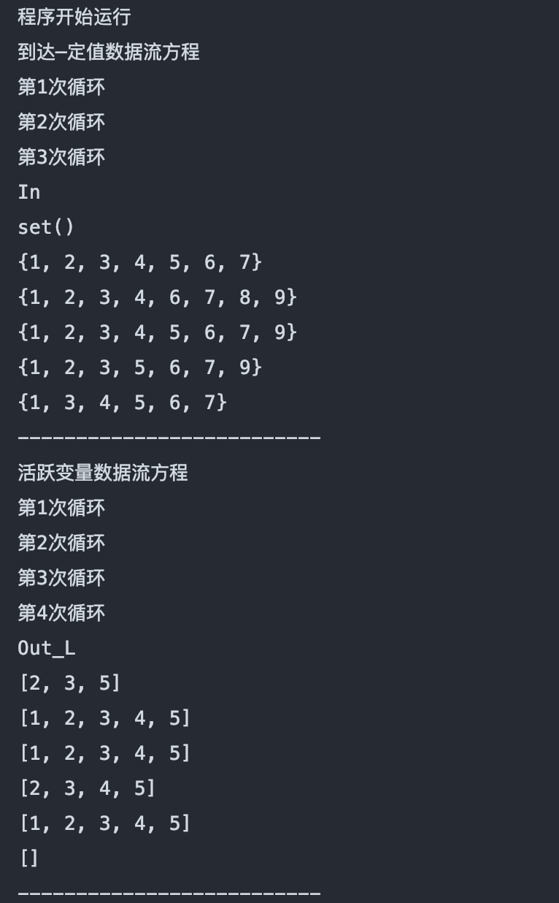
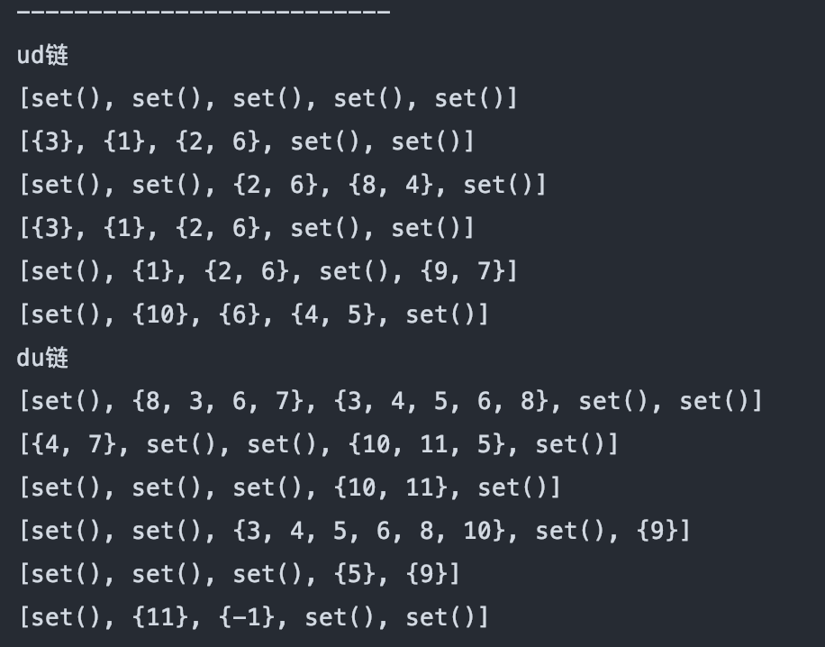

# 数据流方程的相关运算

### Description

编译原理关于ud链，du链和相关集合的运算，考虑的不是很全面。

### Demo

#### 题目相关信息

源自《编译原理》（BIT）第八章课后习题

#### 答案

#### 程序相关结果

最后的-1表示变量定值了但没用

注意所有的对应上和数组的并不相同，输出结果是从1开始的，但数组的访问是从0开始的

---

### 程序存在的问题

1. 在生成ud链和du链的时候，比如生成ud链的时候，如果一个基本块内存在了多个引用点，这个时候要分开生成的。也就是说要生成两个关于这个变量的ud链，对应**不同的引用点**。比如在题目[[1]](#test)中B2块中的C变量。<u>程序目前还是针对变量生成的，并没有根据引用点生成。</u>在写ud链的时候可以用目测法予以校正。

